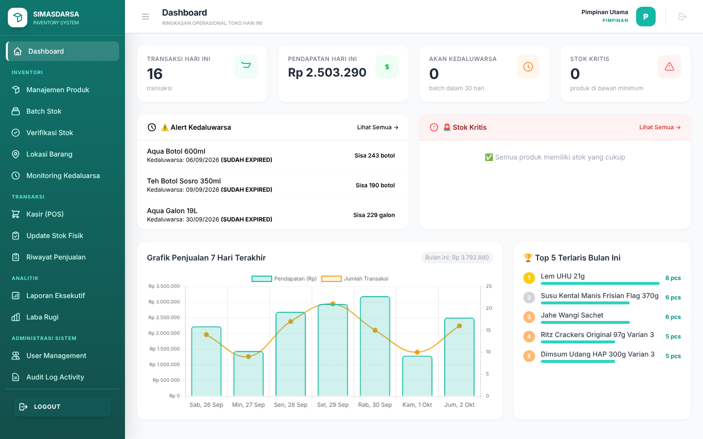
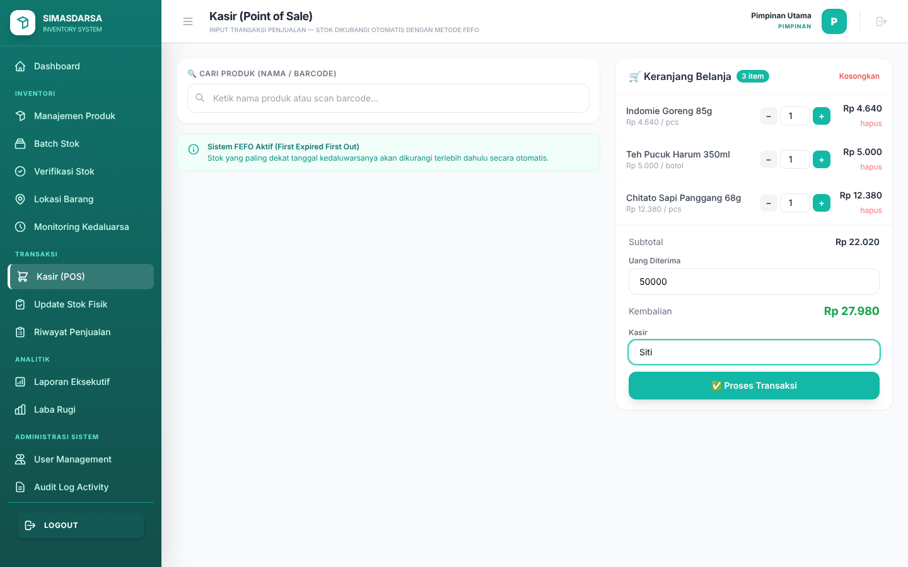
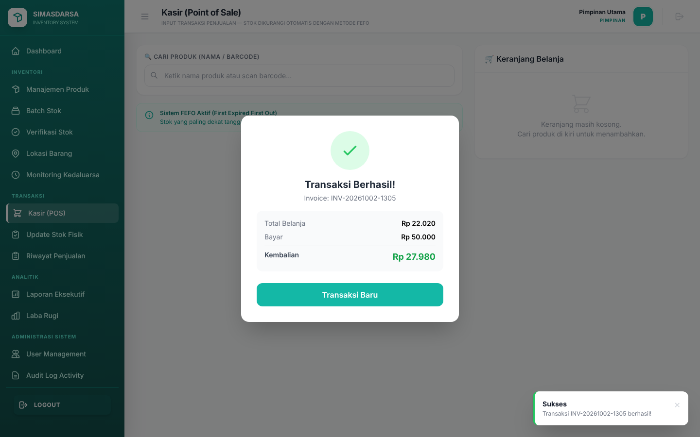
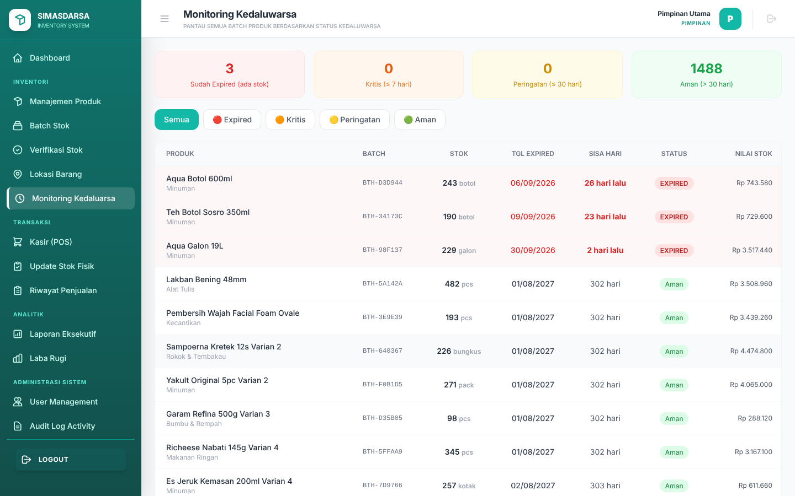
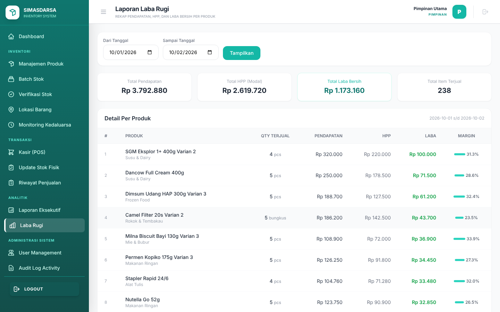
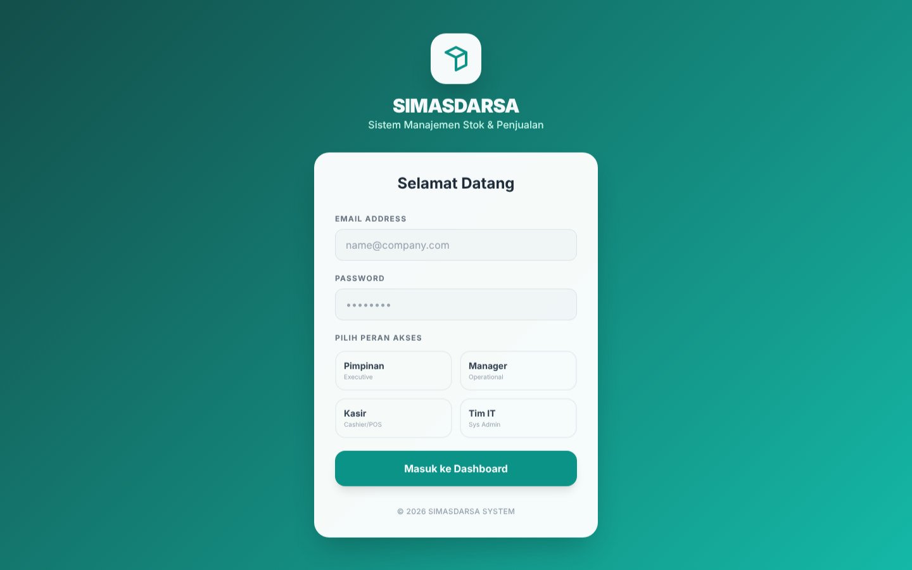
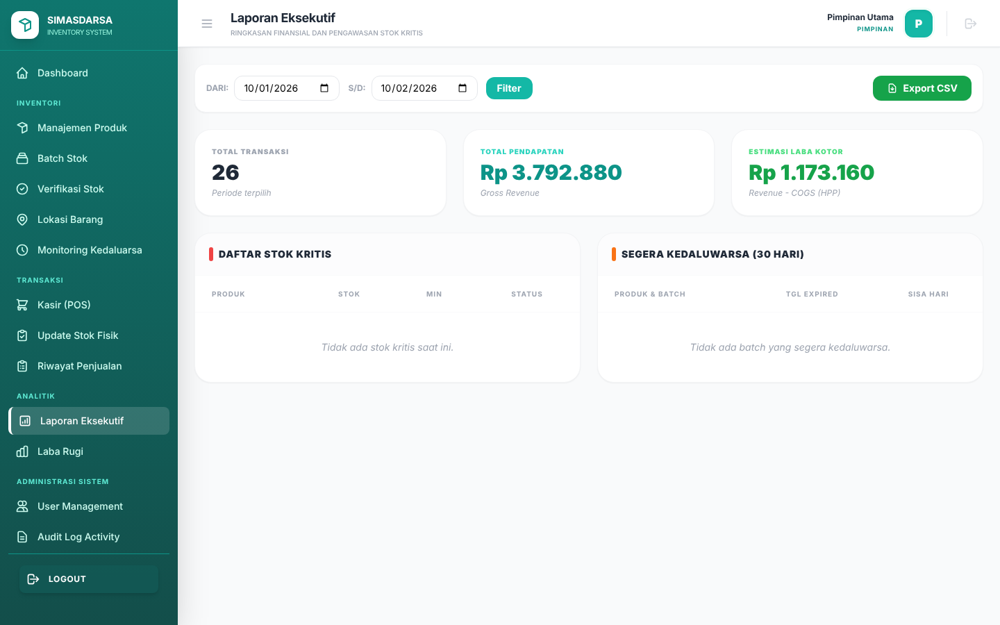

# SIMASDARSA

Sistem informasi manajemen stok dan penjualan berbasis web untuk toko/warung UMKM. Dibangun dengan Laravel dan Tailwind CSS.

Fokus utamanya adalah **stok dengan tanggal kedaluwarsa**: setiap barang masuk dicatat per batch, dan kasir otomatis mengeluarkan stok dari batch yang paling cepat expired (metode FEFO).



## Fitur

- **Kasir (POS) dengan FEFO** (*First Expired, First Out*): stok dipotong dari batch yang expired-nya paling dekat, bisa lintas beberapa batch, dan batch yang sudah expired tidak ikut terjual.
- **Aman untuk transaksi bersamaan**: proses penjualan dibungkus database transaction dan `lockForUpdate()`, jadi dua kasir yang menjual barang sama di waktu bersamaan tidak membuat stok minus.
- **Batch stok** dengan tanggal masuk dan kedaluwarsa, verifikasi stok masuk, update stok fisik (opname), serta lokasi barang.
- **Monitoring kedaluwarsa** dan notifikasi email otomatis setiap hari untuk stok yang akan expired dalam 30 hari.
- **Laporan** laba-rugi per produk dan laporan eksekutif (bisa diekspor ke CSV).
- **Role & permission per menu**: Pimpinan, Tim IT, Manager, dan Kasir. Tim IT bisa mengatur menu apa saja yang boleh dibuka tiap user.
- **Audit log** aktivitas penting: login, logout, hapus produk, dan update stok fisik.

## Tampilan

| Kasir (POS) | Transaksi berhasil |
|---|---|
|  |  |

| Monitoring kedaluwarsa | Laporan laba-rugi |
|---|---|
|  |  |

| Login | Laporan eksekutif |
|---|---|
|  |  |

## Teknologi

- PHP 8.3+ dan Laravel 13
- SQLite (default) atau MySQL/MariaDB
- Tailwind CSS, Alpine.js, Chart.js
- PHPUnit untuk pengujian

## Instalasi

1. Clone repositori lalu masuk ke foldernya.

   ```bash
   git clone https://github.com/Rzkyyy-cpu/simasdarsa.git
   cd simasdarsa
   ```

2. Install dependensi PHP.

   ```bash
   composer install
   ```

3. Salin file environment dan buat application key.

   ```bash
   cp .env.example .env
   php artisan key:generate
   ```

4. Siapkan database. Paling cepat pakai SQLite (sudah jadi default di `.env.example`):

   ```bash
   touch database/database.sqlite
   ```

   Kalau mau pakai MySQL, ubah bagian ini di `.env`:

   ```env
   DB_CONNECTION=mysql
   DB_HOST=127.0.0.1
   DB_PORT=3306
   DB_DATABASE=simasdarsa
   DB_USERNAME=root
   DB_PASSWORD=
   ```

5. Jalankan migrasi dan seeder. Seeder membuat 500 produk dummy, batch stok, riwayat penjualan 90 hari, dan akun demo.

   ```bash
   php artisan migrate --seed
   ```

6. Jalankan server, lalu buka `http://127.0.0.1:8000`.

   ```bash
   php artisan serve
   ```

## Akun Demo

Semua akun memakai password `password`. Saat login, pilih peran yang sesuai dengan akunnya.

| Peran    | Email                   | Akses                                                     |
|----------|-------------------------|-----------------------------------------------------------|
| Pimpinan | pimpinan@simasdarsa.com | Semua menu                                                |
| Tim IT   | tim_it@simasdarsa.com   | Semua menu, termasuk User Management dan Audit Log        |
| Manager  | manager@simasdarsa.com  | Produk, batch stok, verifikasi, lokasi, expired, laporan laba-rugi |
| Kasir    | kasir@simasdarsa.com    | Kasir, update stok fisik, monitoring expired, riwayat penjualan |

Akses Manager dan Kasir bisa diubah lewat akun Tim IT di menu **User Management**. Ganti password akun demo sebelum aplikasi dipakai sungguhan.

## Menjalankan Test

```bash
php artisan test
```

Test memakai database SQLite di memori, jadi tidak mengganggu data lokal. Yang diuji antara lain:

- **FEFO** (`tests/Feature/SaleFefoTest.php`): urutan pemotongan stok, pemotongan lintas batch, batch expired tidak terjual, serta penolakan saat stok atau pembayaran kurang tanpa mengubah stok.
- **Hak akses** (`tests/Feature/AccessTest.php`): login, pembatasan menu sesuai permission, dan semua halaman utama bisa dibuka.
- **Laporan** (`tests/Feature/ReportTest.php`): perhitungan pendapatan dan laba kotor.

## Notifikasi Kedaluwarsa

Perintah berikut mengecek batch stok yang akan expired dalam 30 hari dan mengirim email ke user dengan peran Pimpinan dan Manager:

```bash
php artisan stock:check-expiry
```

Perintah ini dijadwalkan jalan setiap hari pukul 08:00. Supaya jadwal aktif, jalankan scheduler Laravel:

```bash
php artisan schedule:work
```

Secara default email hanya ditulis ke log (`MAIL_MAILER=log`). Isi pengaturan `MAIL_*` di `.env` untuk mengirim email sungguhan.
